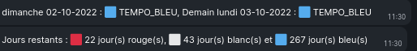

# Alerte EDF tempo

Ce script permet de connaître très simplement la couleur du jour et du lendemain ainsi que le nombre restant de jours des différents couleurs.

En général, EDF annonce la couleur du lendemain vers 11h30.

Je l'ai personnellement branché avec mes salons de discussion (basé sur Matrix / [Element.io](https://element.io) ce qui est très pratique pour être informé des jours blancs et rouges (les plus chers).

# Cron

Voici un exemple de mise en place du cron :

```crontab
10 11 * * * /home/user/tempo-couleur.sh

00 */2 * * * /home/user/tempo-couleur-retry.sh
```

# Changelog

- 2024-12-09 :

    EDF a durci la récupération des données. Le script a été retravaillé. Il faut aussi installer un navigateur web en ligne de commande pour simuler un utilisateur.

    `sudo apt install lynx`

# Capture


